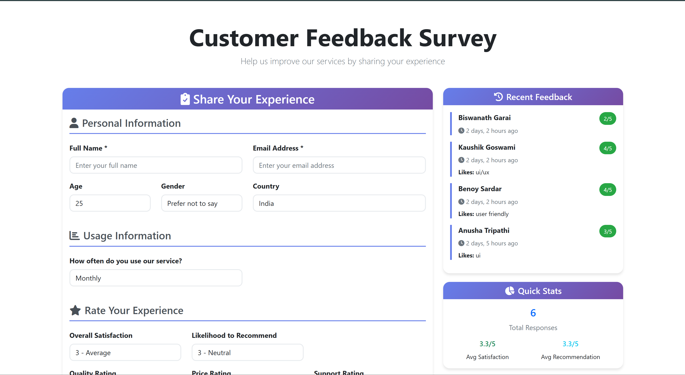
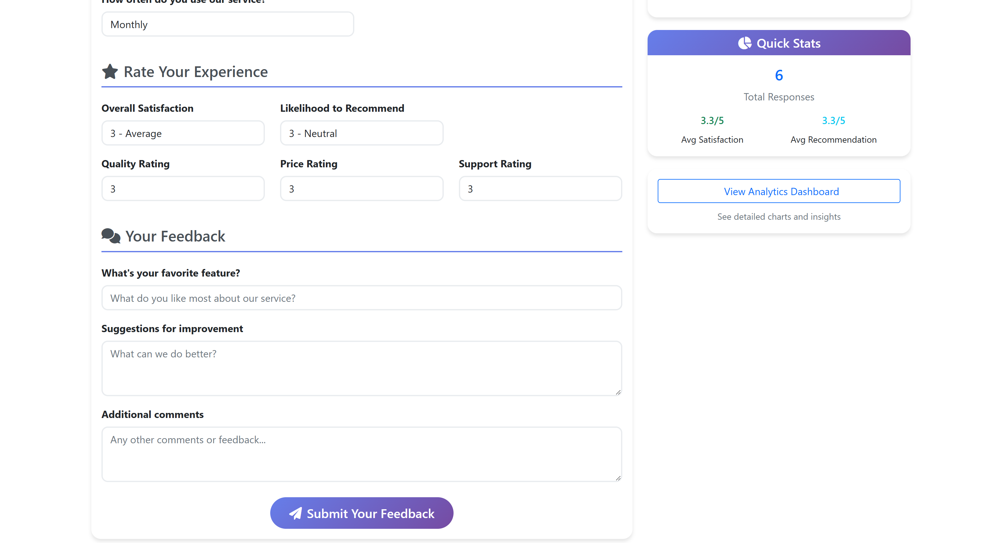
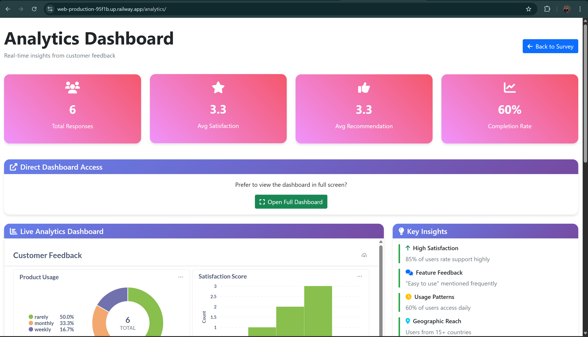
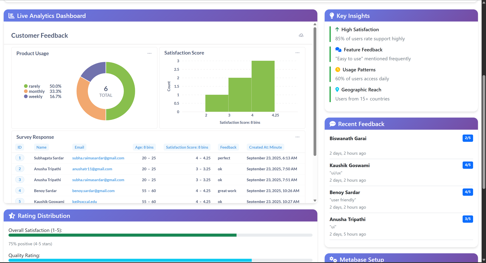
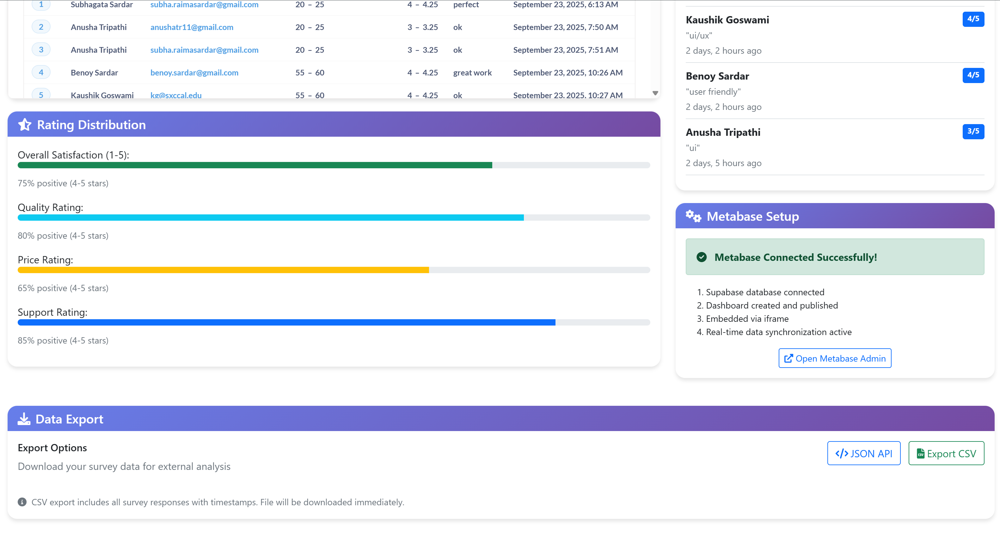

# Internship Django Project

## Project Name

**Internship Project – Customer Feedback & Analytics System**

## Overview

This is a **full-stack web application** built using **Django** (backend + frontend) with a **PostgreSQL database on Supabase**. The project includes a **customer satisfaction survey form**, real-time data storage, and **interactive Metabase dashboards** for analytics visualization. The application is **deployed on Render** and accessible via a public link.

---

## Features

* User-friendly **customer feedback form** with multiple field types and validation.
* **Real-time database integration** with Supabase PostgreSQL via connection pooler.
* **Interactive analytics dashboards** embedded using Metabase.
* **Responsive Bootstrap UI** that works on desktop and mobile.
* **Secure deployment** with HTTPS, session, and CSRF protections.
* **Data export functionality** (JSON API, CSV).

---

## Technologies Used

* **Backend:** Django 5.2.6, Python 3.11
* **Frontend:** HTML5, CSS3, Bootstrap 5, JavaScript
* **Database:** Supabase PostgreSQL
* **Analytics:** Metabase (embedded charts and dashboards)
* **Deployment:** Render
* **WSGI Server:** Gunicorn

---

## Setup & Installation

1. **Clone the repository**

   ```bash
   git clone https://github.com/yourusername/internship-survey-app
   cd internship-project

2. *Create a virtual environment*

   bash
   python -m venv venv
   source venv/bin/activate   # Linux/macOS
   venv\Scripts\activate      # Windows
   

3. *Install dependencies*

   bash
   pip install -r requirements.txt
   

4. *Environment variables*

   * Create a .env file in the project root:

     
     DATABASE_URL=your_supabase_database_url
     DJANGO_SECRET_KEY=your_secret_key
     DJANGO_DEBUG=True
     

5. *Run migrations*

   bash
   python manage.py migrate
   

6. *Run the development server*

   bash
   python manage.py runserver
   

7. *Access the application*
   Open your browser at http://127.0.0.1:8000/

---

## Deployment

The project is *deployed on Railway*:
[https://web-production-95f1b.up.railway.app/](https://web-production-95f1b.up.railway.app/)

---

## Screenshots


 
 
 


---

## Author

*Subhagata Sardar*
